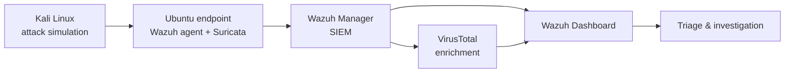

# Emmanuel Ademoyega
### SOC Analyst · Blue Team · Purple Team

**I build security labs, attack them in controlled conditions, detect the activity, investigate it and write it up to report standard.**

[**Featured Work**](#-featured-work) · [**Portfolio Map**](#-portfolio-map) · [**Skills**](#-core-skills) · [**Tools**](#-tools--technologies) · [**Training**](#-training--professional-development) · [**Contact**](#-contact)

---

## 👋 About Me

I'm a hands-on cybersecurity practitioner who completed the **TS Academy SOC Analyst programme**. My focus is **security operations**: SIEM monitoring, alert triage, network intrusion detection, threat intelligence and incident response. I back that up with offensive skills in **vulnerability assessment and penetration testing**.

I learn by building. Everything here was deployed, broken, detected, investigated and documented in my own lab environments. I spend time on the attacker's side because it makes me a better defender: once I know how an attack works, I know what it looks like in the logs.

> **Currently seeking:** SOC Analyst (Tier 1 / Tier 2), Cybersecurity Analyst and Security Monitoring roles, with a long-term path toward **Purple Team operations**.

---

## 📊 Portfolio at a Glance

| | |
| :-- | :-- |
| 🧪 **12 documented labs & projects** | 4 SOC/SIEM labs · 1 incident response lab · 3 network labs · 4 report-standard projects |
| 📄 **4 professional deliverables** | 3 PDF reports (39 pages) + an 18-slide awareness training deck |
| 🎯 **6 vulnerabilities confirmed** | Manually verified across Kioptrix and Metasploitable 2, including a vsftpd 2.3.4 backdoor (CVE-2011-2523) |
| 🚨 **87 Nmap-related detections** | Correlated end-to-end from network traffic → `eve.json` → Wazuh rule → dashboard |
| 🦠 **64 / 66 vendor detections** | Automated malware verdict via a Wazuh → VirusTotal API integration |
| 🎣 **1 live phishing campaign investigated** | Report IR-2026-002: confirmed credential harvesting, sender infrastructure attributed, IOCs published defanged |

---

## ⭐ Featured Work

### 1. 🛡️ SOC Home Lab: Wazuh SIEM, Suricata IDS & Threat Intelligence
**[→ View lab](./1-wazuh-Labs-Investigation)**

Built a working SOC environment from scratch and validated it with controlled attacks.

- Deployed **Wazuh SIEM** with Docker/Docker Compose and enrolled an Ubuntu endpoint with the **Wazuh agent**
- Emulated a **Diamorphine Linux kernel rootkit** and traced the resulting telemetry through Wazuh alerts
- Integrated **Suricata IDS** with Wazuh and detected ICMP sweeps, Nmap host discovery and port scans
- Automated malware triage by integrating **VirusTotal** with Wazuh; the EICAR test file was flagged by 64 of 66 engines
- Mapped detections to **MITRE ATT&CK** and worked through Docker, DNS and agent-connectivity problems along the way

`Wazuh` `Suricata` `VirusTotal API` `Docker` `Diamorphine` `EICAR` `MITRE ATT&CK`

---

### 2. 🎓 Vulnerability Assessment Capstone: Kioptrix & Metasploitable 2
**[→ View project](./4-Projects/1-Vulnerability-Assessment-Capstone)** · **[📄 Report (PDF)](./4-Projects/1-Vulnerability-Assessment-Capstone/TS-Academy-Capstone-Vulnerability-Assessment-Report.pdf)**

A formal, consultant-style assessment of a simulated healthcare organisation. This was my TS Academy capstone.

- Ran full service/version discovery with Nmap, then **manually verified every finding** to rule out false positives
- Confirmed **6 vulnerabilities**, including the vsftpd 2.3.4 backdoor, unauthenticated MySQL root access, end-of-life OpenSSH/Apache/OpenSSL and RPCBind exposure
- Rated risk by likelihood × impact and wrote a **root-cause remediation plan** based on defence in depth
- Wrote **5 security policies** (patch management, access control, vulnerability management, authentication, secure configuration)

`Nmap` `CVE Research` `Manual Verification` `Risk Rating` `Remediation` `Executive Reporting`

---

### 3. 📡 Network Intrusion Detection: Suricata + Wazuh
**[→ View project](./4-Projects/2-Network-Intrusion-Detection-Suricata-Wazuh)** · **[📄 Report (PDF)](./4-Projects/2-Network-Intrusion-Detection-Suricata-Wazuh/Network-Intrusion-Detection-Suricata-Wazuh-Report.pdf)**

A fully traceable network detection pipeline, documented from the packet to the dashboard.

- Deployed Suricata with the **Emerging Threats Open** ruleset and fed its `eve.json` output into Wazuh as JSON
- Checked detection with controlled `nmap -A -p- -T4` and ICMP traffic; this produced `ET SCAN` and `GPL ICMP_INFO` alerts
- Correlated **87 Nmap-related events** and built a **custom Wazuh visualisation** to prioritise rule tuning
- Designed a `firewall-drop` **active-response** control for high-severity Suricata alerts

`Suricata` `Emerging Threats` `Wazuh` `eve.json` `Detection Engineering` `Active Response`

---

### 4. 🎣 Phishing Incident Response: Report IR-2026-002
**[→ View project](./4-Projects/3-Phishing-Incident-Response)** · **[📄 Report (PDF)](./4-Projects/3-Phishing-Incident-Response/Phishing-Incident-Response-Report-IR-2026-002.pdf)**

A passive investigation of a live "Microsoft Security Team" credential-harvesting email.

- Extracted and **defanged IOCs** (sender, domain, mail host, IP, URL and SHA-256 payload hash)
- Traced the sender to a **compromised Spanish shared-hosting domain** that had **no DMARC enforcement**
- Found that the shortened payload link had been **disabled by TinyURL's own abuse review**, which independently backed up the verdict
- Reached a **high-confidence verdict** and wrote up containment, a threat hunt and control improvements (DMARC/SPF/DKIM, phishing-resistant MFA)

`VirusTotal` `urlscan.io` `MXToolbox` `DNSDumpster` `OSINT` `TLP:AMBER`

---

### 5. 📚 Phishing Awareness Training
**[→ View project](./4-Projects/4-Phishing-Awareness)** · **[📊 Deck (PPTX)](./4-Projects/4-Phishing-Awareness/Phishing-Awareness-Project.pptx)**

This is the preventive side of my incident response work: an 18-slide training deck written for non-technical staff. It covers phishing red flags, spotting fake websites, 7 social-engineering tactics, 3 real-world breach case studies and a 5-question scenario quiz.

`Security Awareness` `Social Engineering` `Risk Communication`

---

## 🧭 Portfolio Map

The repository follows a SOC analyst's workflow. Folders are numbered so GitHub shows them in this order.

| # | Section | What's Inside |
| :-: | ------- | ------------- |
| **1** | [**Wazuh Labs & Investigation**](./1-wazuh-Labs-Investigation) | SOC home lab: SIEM deployment, rootkit emulation, Suricata IDS, VirusTotal automation |
| **2** | [**Incident Response & Threat Hunting**](./2-Incident-Response-Threat-Hunting) | Phishing incident response, IOC extraction and threat-intelligence correlation |
| **3** | [**Network Operations**](./3-Network-Operations) | Cisco Packet Tracer: LAN design, subnetting, routing, DNS, DHCP and wireless |
| **4** | [**Projects**](./4-Projects) | Four report-standard deliverables: **assess → detect → respond → prevent** |

<b>📂 Expand the full lab index</b>

 

**1 · Wazuh Labs & Investigation**
- [Lab 01: SOC Lab Deployment (Wazuh on Docker + Ubuntu agent)](./1-wazuh-Labs-Investigation/lab01-soc-lab-deployment.md)
- [Lab 02: Diamorphine Rootkit Attack Simulation & Detection](./1-wazuh-Labs-Investigation/lab02-Diamorphine-rootkit-attack.md)
- [Lab 03: IDS/IPS Suricata: Reconnaissance Detection](./1-wazuh-Labs-Investigation/lab03-IDS-IPS-Suricata-Detection-Reconnaissance.md)
- [Lab 04: Automated Malware Detection & Threat Intelligence (VirusTotal)](./1-wazuh-Labs-Investigation/lab04-automated-Malware-Detection-threat-intelligence.md)

**2 · Incident Response & Threat Hunting**
- [Lab 01: Phishing Incident & Threat Analysis](./2-Incident-Response-Threat-Hunting/lab01-phishing-incident-threat-analysis.md)

**3 · Network Operations**
- [Lab 01: Building a LAN](./3-Network-Operations/lab01-Building-LAN-network.md)
- [Lab 02: Multi-Network Communication & DNS Configuration](./3-Network-Operations/lab02-Multi-network-Communication-DNS-Config.md)
- [Lab 03: Wireless Network Configuration & Connectivity](./3-Network-Operations/lab03-Wireless-Network-Config-and-Connectivity.md)

**4 · Projects**
1. [Vulnerability Assessment Capstone: Kioptrix & Metasploitable 2](./4-Projects/1-Vulnerability-Assessment-Capstone)
2. [Network Intrusion Detection: Suricata + Wazuh](./4-Projects/2-Network-Intrusion-Detection-Suricata-Wazuh)
3. [Phishing Incident Response: IR-2026-002](./4-Projects/3-Phishing-Incident-Response)
4. [Phishing Awareness Training](./4-Projects/4-Phishing-Awareness)

---

## 🧠 Core Skills

| Domain | Skills | Where I've shown it |
| ------ | ------ | ------------------- |
| 🔵 **Security Operations** | SIEM monitoring, alert triage, log analysis, event correlation, MITRE ATT&CK mapping | [SOC Lab](./1-wazuh-Labs-Investigation) |
| 🔵 **Detection Engineering** | IDS deployment, ruleset management, log ingestion, custom visualisations, active response | [Suricata + Wazuh](./4-Projects/2-Network-Intrusion-Detection-Suricata-Wazuh) |
| 🔵 **Incident Response** | Phishing analysis, IOC extraction, infrastructure attribution, containment & remediation planning | [IR-2026-002](./4-Projects/3-Phishing-Incident-Response) |
| 🔵 **Threat Intelligence** | VirusTotal API automation, file-hash analysis, domain/IP reputation, passive OSINT | [SOC Lab](./1-wazuh-Labs-Investigation) · [IR Lab](./2-Incident-Response-Threat-Hunting) |
| 🔴 **Vulnerability Assessment** | Recon & enumeration, CVE validation, false-positive elimination, risk rating | [Capstone](./4-Projects/1-Vulnerability-Assessment-Capstone) |
| 🔴 **Penetration Testing** | Metasploit exploitation, backdoor & brute-force techniques, payload delivery | Lab practice: Metasploitable 2, Kioptrix, Windows 7 |
| 🌐 **Networking** | IPv4 & subnetting, switching, routing, DNS, DHCP, wireless security, troubleshooting | [Network Ops](./3-Network-Operations) |
| 🐧 **Systems** | Linux & Windows administration, Docker, virtualisation, service troubleshooting | [SOC Lab](./1-wazuh-Labs-Investigation) |
| 📝 **Communication** | Executive reporting, security policy writing, awareness training design | [Projects](./4-Projects) |

---

## 🧰 Tools & Technologies

| Category | Tools |
| -------- | ----- |
| **SIEM & Monitoring** | Wazuh · Splunk · Journald / Linux system logs |
| **Network Security** | Suricata (Emerging Threats ruleset) · Wireshark · Nmap |
| **Threat Intelligence & OSINT** | VirusTotal · urlscan.io · MXToolbox · DNSDumpster |
| **Offensive Security** | Metasploit · Nessus · Nmap · Kali Linux |
| **Lab Targets** | Kioptrix · Metasploitable 2 · Windows 7 · EICAR · Diamorphine |
| **Platforms & Infrastructure** | Ubuntu · Kali Linux · Windows · Docker & Docker Compose · Oracle VirtualBox |
| **Networking** | Cisco Packet Tracer |
| **Frameworks** | MITRE ATT&CK · TLP · likelihood × impact risk rating |

---

## 🎓 Training & Professional Development

| Provider | Focus |
| -------- | ----- |
| **TS Academy** | SOC Analyst programme, completed with a vulnerability assessment capstone |
| **Code Alpha** | Practical SOC / cybersecurity experience |
| **ISC2** | Cybersecurity fundamentals |
| **Cisco Networking Academy** | Networking · Linux administration · Windows administration |
| **TryHackMe** | Hands-on offensive & defensive rooms |
| **LetsDefend** | SOC alert triage & incident investigation practice |

---

## 🎯 Career Focus

**Target roles:** SOC Analyst · Cybersecurity Analyst · Security Monitoring Analyst · Incident Responder · Vulnerability Analyst

**Growth path:** SOC operations → detection engineering → **Purple Team**, using an attacker's mindset to build better defences.

> *Learn how attacks work. Detect how they appear. Investigate what happened. Build better defences.*

---

## 📬 Contact

I'm open to SOC and cybersecurity analyst opportunities, collaborations and feedback on this portfolio.

---

## ⚠️ Disclaimer

Every activity in this portfolio was carried out in **isolated, authorised lab environments**, against **deliberately vulnerable machines**, or through **passive, non-intrusive OSINT**. It was all done for educational and professional-development purposes. Simulated organisations are fictional. Indicators are published **defanged**. No unauthorised systems, networks, accounts or third-party infrastructure were targeted.
